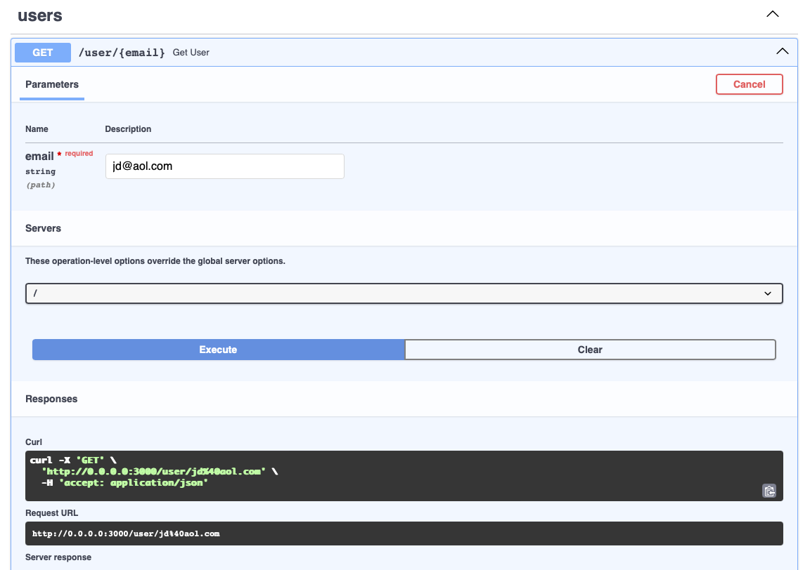
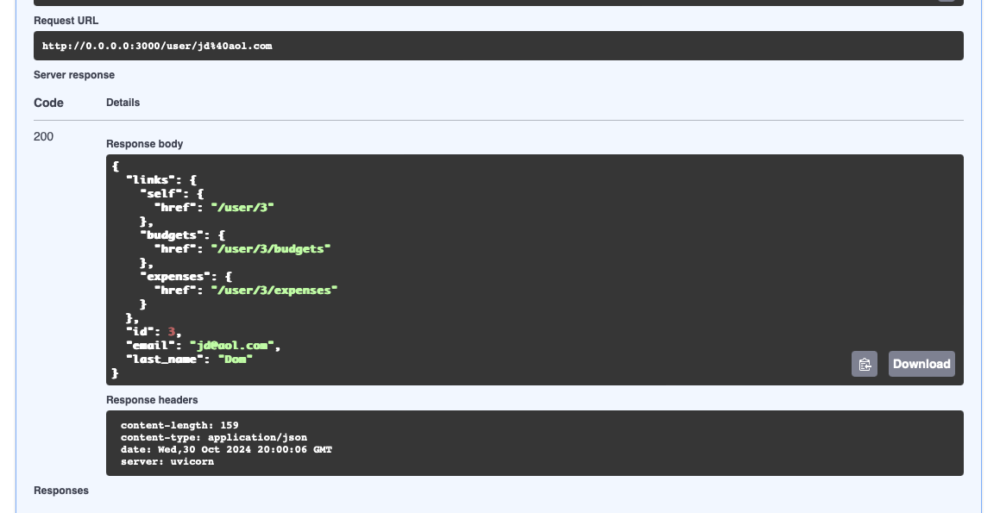
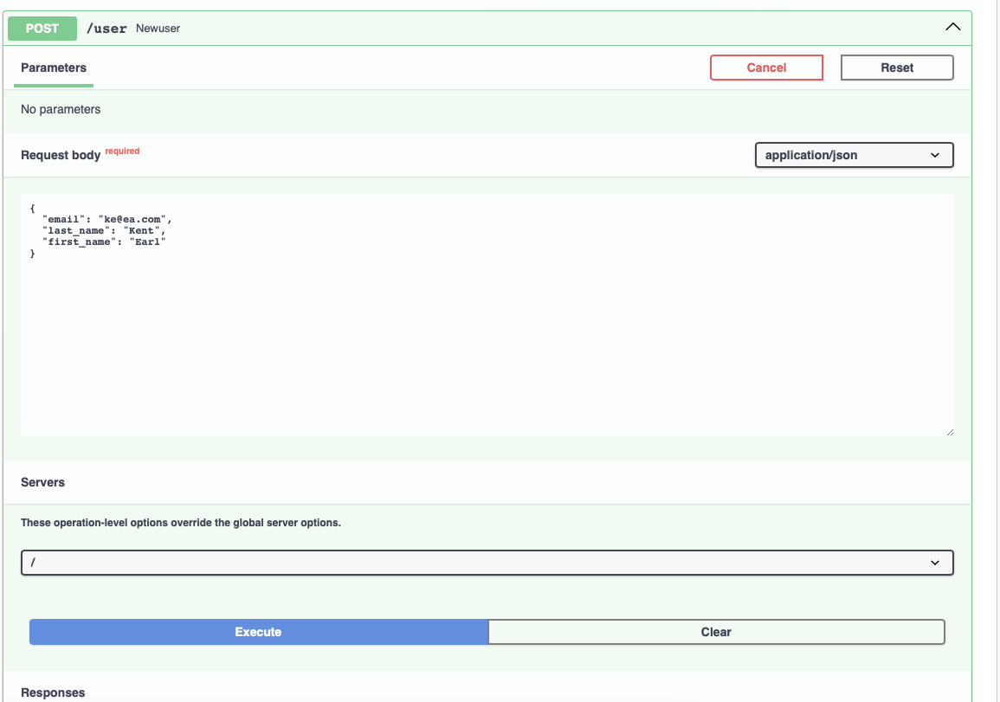
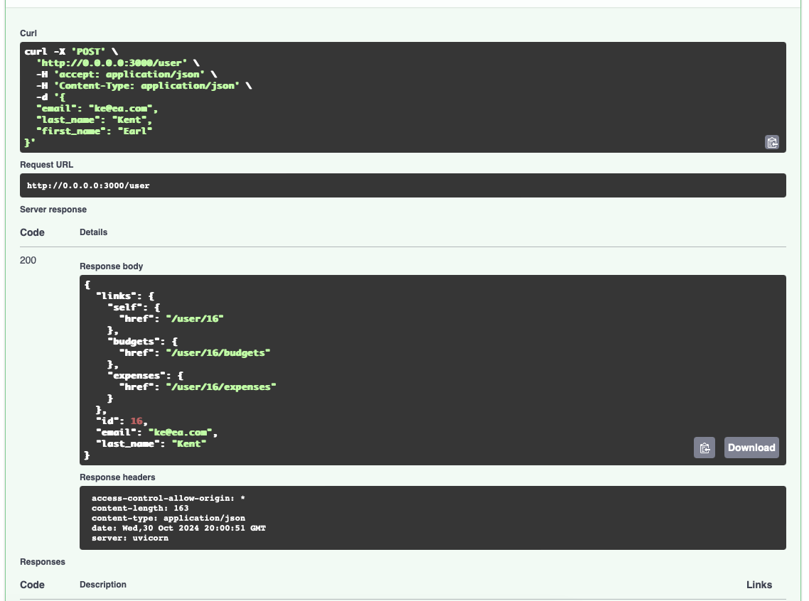
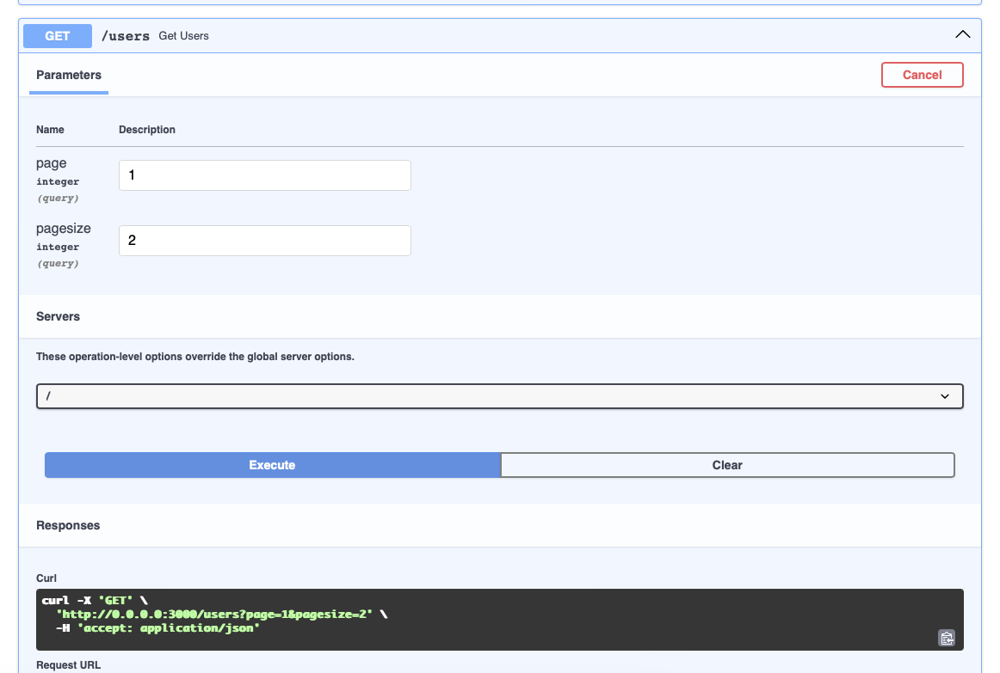
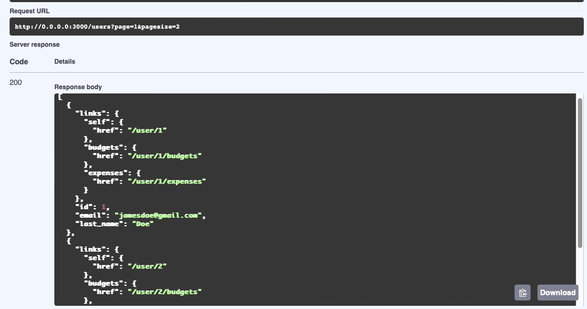
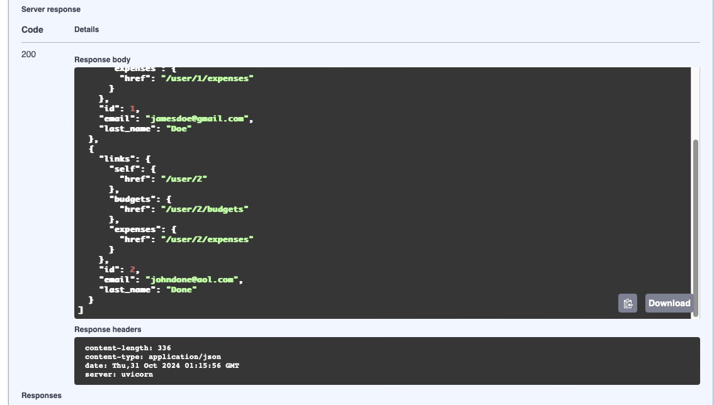

# User Microservice for the expense tracker

- Implemented the CRUD operations for the user, mainly getting a specific user by email, getting all users(not fully implemented - having a bug with the pagination), and post for registering new users. 
- Implemented Pagination only for cases when we're to get all the users... a page has a limit of ten entries by default
- Implemented HATEOAS, using the userID, to enhance communication to budget and expenses.
- bug solved, inconsistency between related functions: get_all and get_data_objects(which get_all calls and is responsible for getting every user from the database)
- pagination implemented
  
#Output for get user by email:

#Output for posting a new user:

#Output for getting all the registered users.

